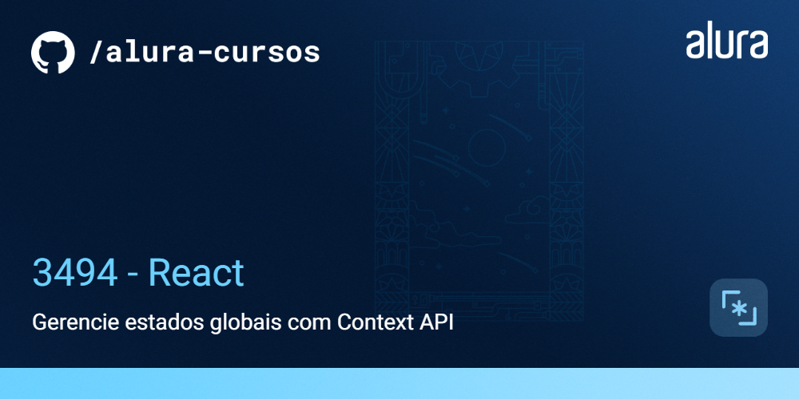

# Meteora - E-commerce de Moda

O Meteora é um projeto de e-commerce em fase de desenvolvimento inicial. Este README fornece informações sobre o projeto, suas funcionalidades e como executá-lo em seu ambiente local.


## 🔨 Funcionalidades do projeto

Neste estágio inicial de desenvolvimento, o Meteora possui as seguintes funcionalidades:

- Adicionar itens ao carrinho
- Remover itens do carrinho
- Visualizar a página do carrinho
- Deletar itens do carrinho

O [Figma dessa aplicação você encontra aqui](https://www.figma.com/file/R5ATrWK1nC44Eyeo6XZXlr/Meteora---Context-API?node-id=2386%3A2430&mode=dev).

## ✔️ Técnicas e tecnologias utilizadas

O projeto Meteora utiliza as seguintes tecnologias e bibliotecas:

- `React` - Framework JavaScript
- `Vite` - Build tool para desenvolvimento rápido
- `JavaScript` - Linguagem de programação principal
- `Context API` - Para gerenciamento de estado
- `useReducer` - Para controle de estado
- `useMemo` - Para otimização de desempenho
- `Bootstrap` - Framework de design e componentes

## 🛠️ Abrir e rodar o projeto

Para executar o projeto Meteora em seu ambiente local, siga estas etapas:

1. Certifique-se de ter o Node.js instalado em sua máquina.

2. Baixe o repositório do projeto:

3. Extraia os arquivos para uma pasta de sua preferência.

4. Navegue até a pasta em questão via terminal (cmd):

```bash
cd repo-meteora
```

5. Instale as dependências usando o npm:

```bash
npm install
```

6. Inicie o projeto localmente:

```bash
npm run dev
```

7. Abra seu navegador e acesse a url exibida no seu terminal para visualizar o projeto.

## 📚 Mais informações do projeto

O Meteora é um e-commerce fictício de moda em constante desenvolvimento. Este projeto visa aprimorar as habilidades em React, e apresentar a Context API como uma solução para gerenciamento de estados globais de uma aplicação React.

O design e protótipo deste projeto podem ser encontrados [aqui](https://www.figma.com/file/R5ATrWK1nC44Eyeo6XZXlr/Meteora---Context-API?node-id=2386%3A2430&mode=dev).

Aproveite o desenvolvimento e aprimoramento do Meteora!
